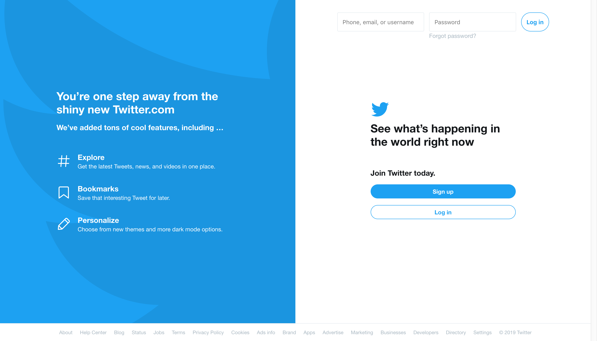
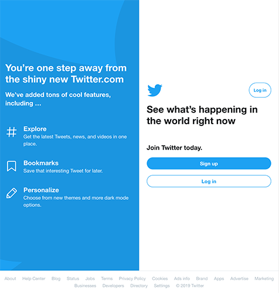
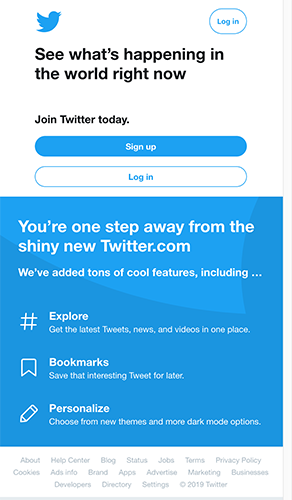

# Replicating Twitter's Homepage

_Assignment to code a visual and peripherally-interactive replica of Twitter's homepage in only HTML and CSS._

## Full-sized screen
_Width: 1025px+_

***

## Mid-sized screen
_@media (min-width: 800px) and (max-width: 1024px)_

***

## Small-sized screen
_@media (max-width: 799px)_

***

## Mobile
_Portrait orientation_

